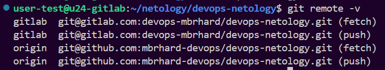
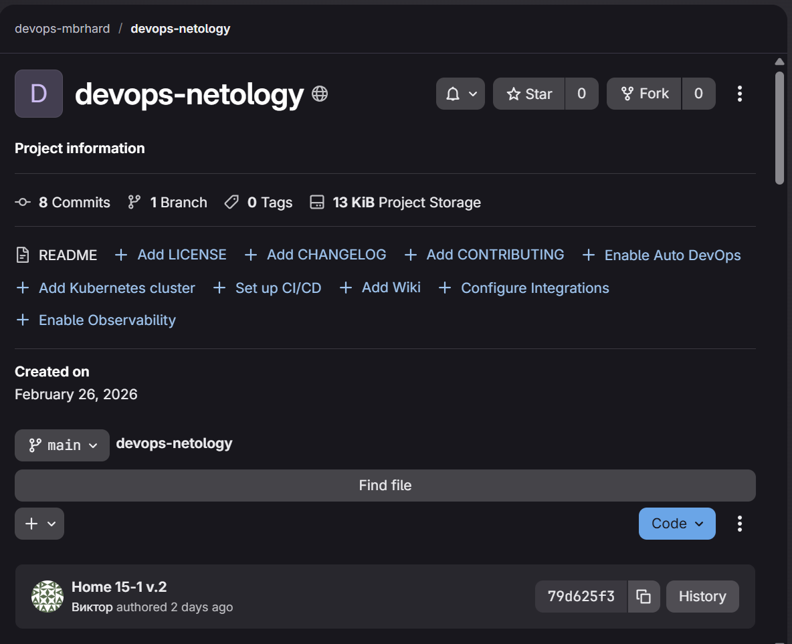
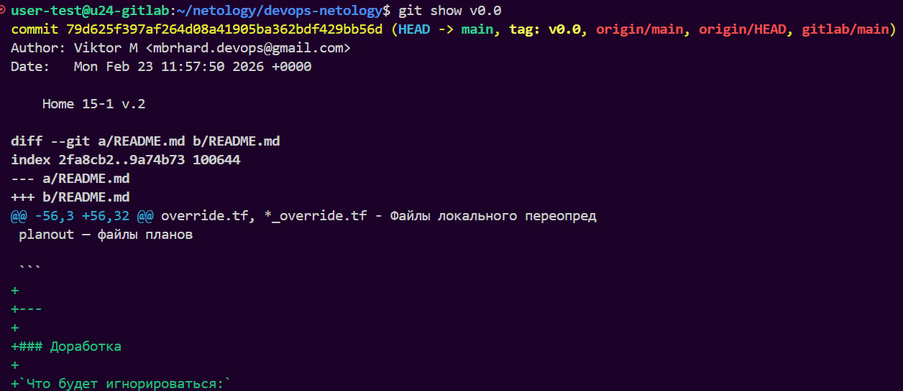
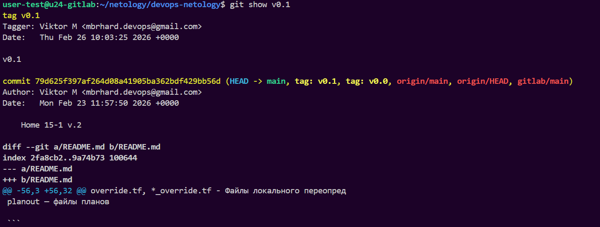
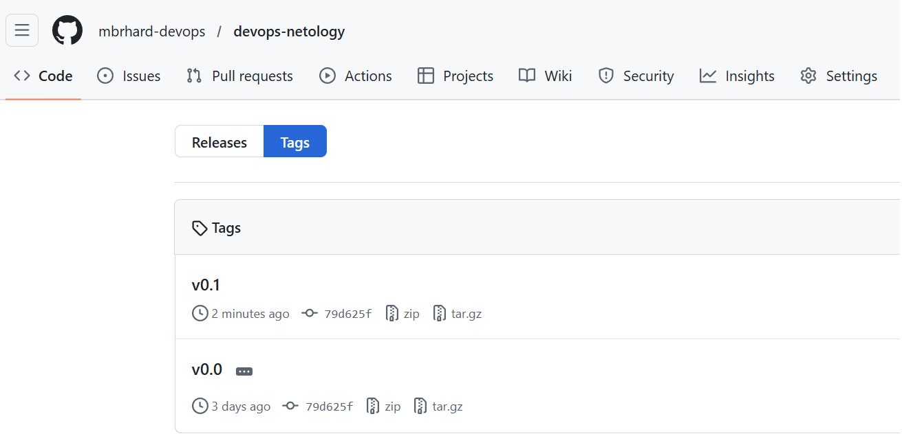
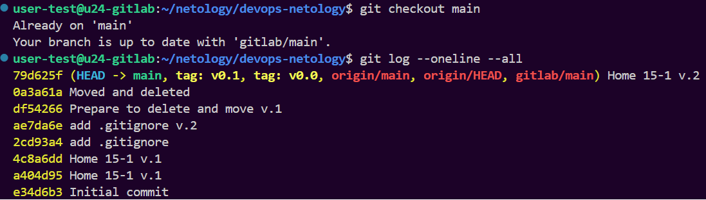
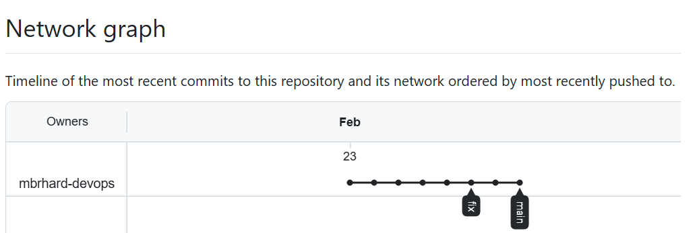
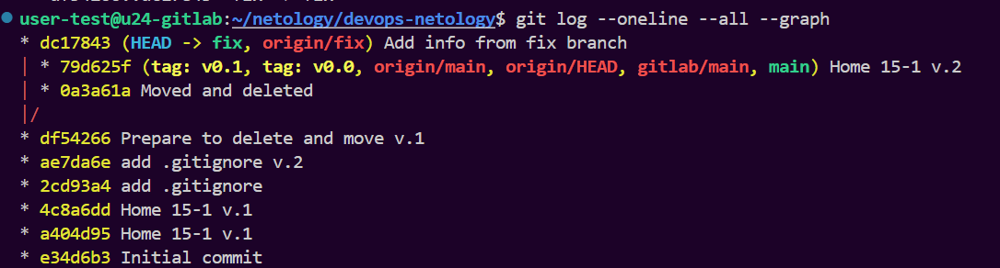

# Домашнее задание к занятию 15.2 "`Основы Git`" - `Маховский Виктор`

### Задание 1. Знакомимся с GitLab и Bitbucket

---

`Код:`
```
cd /netology/devops-netology/
git remote add gitlab git@gitlab.com:devops-mbrhard/devops-netology.git
git push -u gitlab main
git remote -v
```






---

### Задание 2. Теги

---

`Код:`
```
cd /netology/devops-netology/
git tag v0.0
git tag -l
git remote -v
git push --tags origin
git push --tags gitlab

git tag -a v0.1 -m "v0.1"
git push --tags origin
git push --tags gitlab
```








---


### Задание 3. Ветки

---

`Код:`
```
cd /netology/devops-netology/
git checkout main
git log --oneline --all
git checkout df54266
git switch -c fix
git push -u origin fix

git add README.md
git commit -m "Add info from fix branch"
git push origin fix
git log --oneline --all --graph
```







---

### Задание 4. Упрощаем себе жизнь

---

Жизнь пока не упростил, так как работаю в Visual Studio Code. Но для него есть расширения, попробую поставить.

На репозиторий в GitHub: https://github.com/mbrhard-devops/devops-netology

На репозиторий в GitLab: https://gitlab.com/devops-mbrhard/devops-netology

---